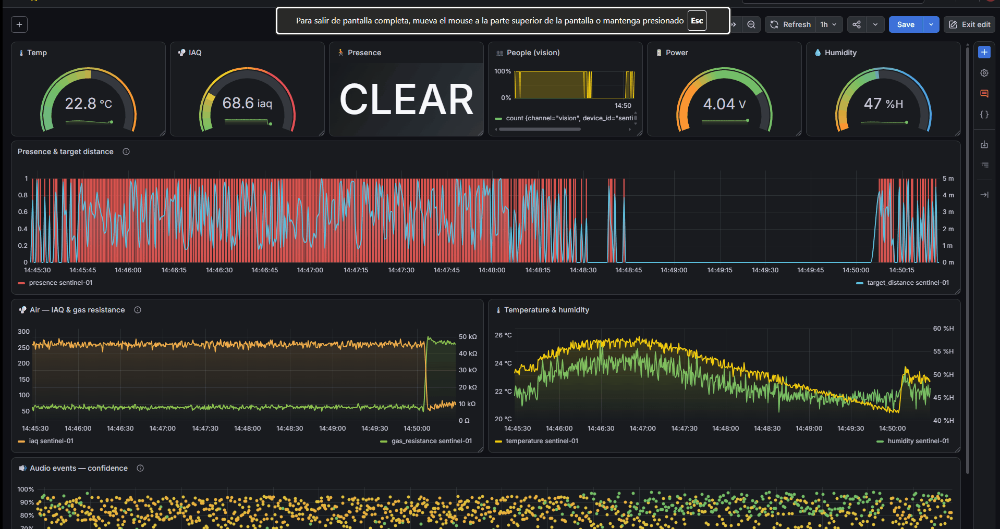
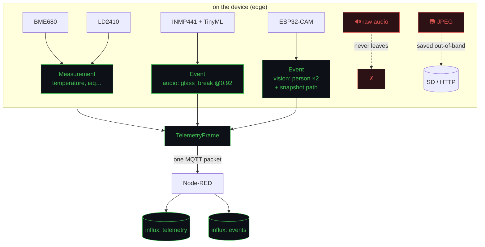
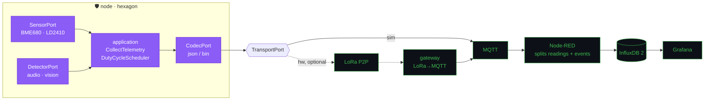
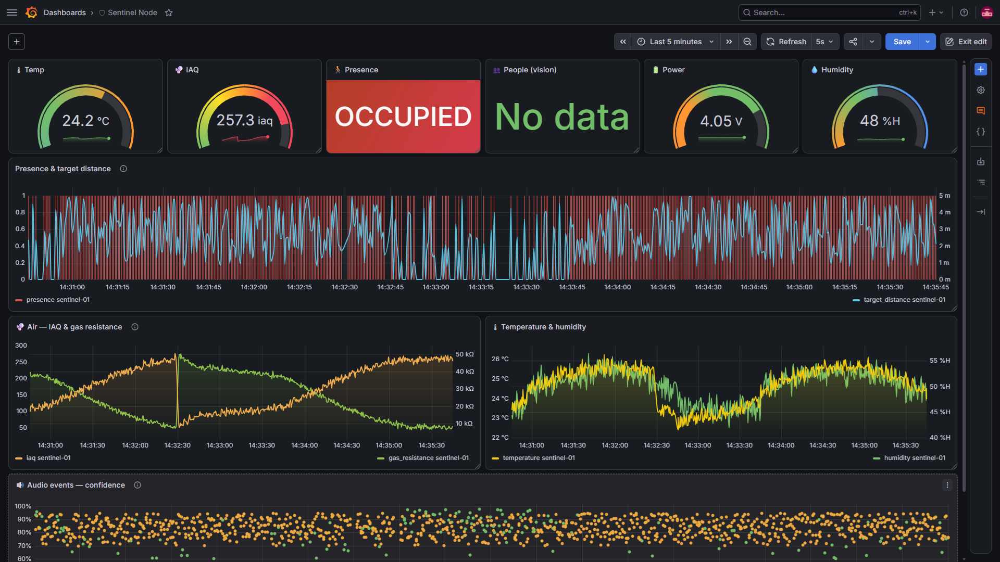
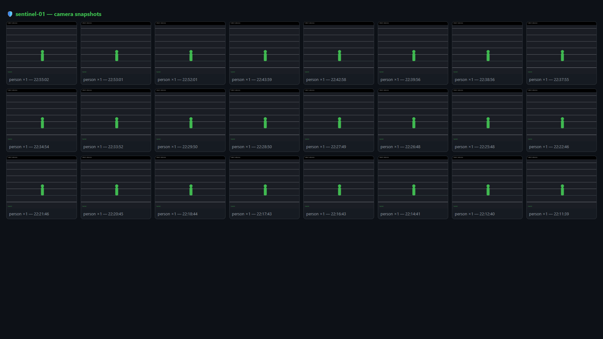
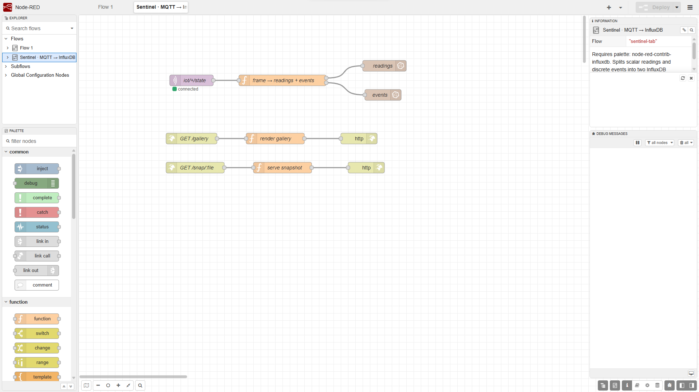
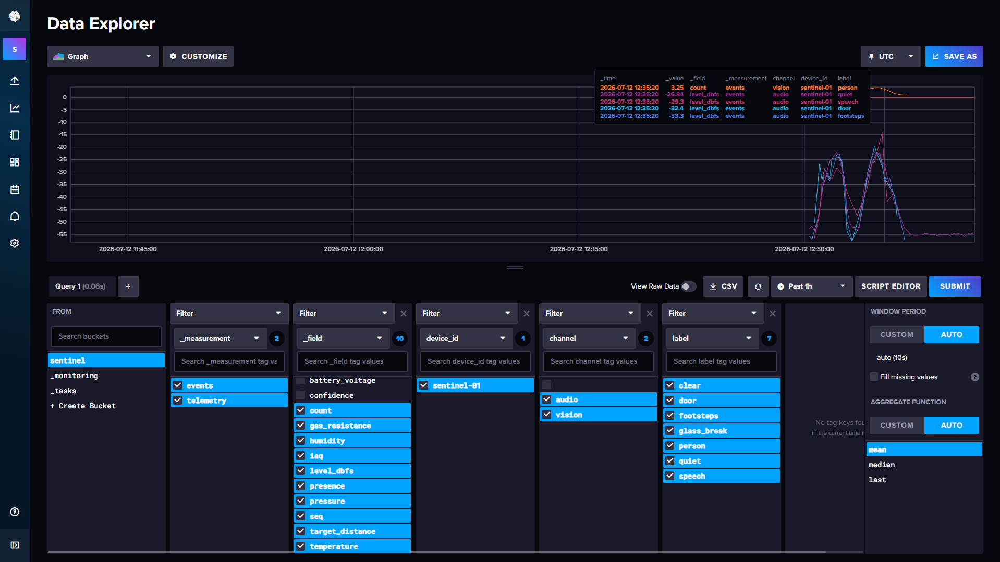
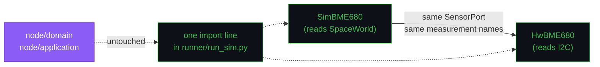

# 🛡️ sentinel-node

[](https://github.com/Zoel-Manchon/sentinel-node/actions/workflows/ci.yml)


**Multi-sensor edge sentinel** for a monitored space — air quality (BME680),
mmWave human presence (LD2410), and **on-device ML** for acoustic events
(INMP441 + TinyML) and vision (ESP32-CAM). One hexagonal core, one pipeline:
**MQTT → Node-RED → InfluxDB → Grafana**.

<p align="center">
  
</p>

> **Sim-first.** The full pipeline runs today against a *coherent simulated
> space* — an occupancy schedule drives everything at once: the presence radar
> sees people, CO₂/VOC rises with the crowd, the room warms, sound events grow
> more likely, the camera counts heads. When the hardware arrives, only the
> adapters change — the domain and use cases ship to the ESP32 **verbatim**,
> sensor by sensor. The ones you don't have yet stay simulated.

## At a glance

|  |  |
| --- | --- |
| **What it is** | A multi-sensor edge sentinel for a monitored space: air quality (BME680), mmWave human presence (LD2410), on-device ML for acoustic events (INMP441 + TinyML) and vision (ESP32-CAM). One hexagonal core, one pipeline. |
| **The one idea** | **Raw media never enters the pipeline.** The audio node runs the classifier on-device and publishes only the verdict; the camera writes the JPEG out-of-band and puts a *path* in the event. A time-series database is not a blob store, and a microphone that ships audio is a different product with different consent. |
| **Two kinds of observation** | A `Measurement` is a scalar reading and goes to InfluxDB's `telemetry`. An `Event` is a discrete classification from an edge model and goes to `events`, with label and channel as tags. Separating the data plane from the event plane is the point. |
| **Sim-first** | The whole pipeline runs today against a **coherent simulated space**: one occupancy schedule drives everything at once, so the radar sees people, CO₂ rises with the crowd, the room warms and sound events grow likelier — together, because they share a cause. |
| **Built with** | Python 3.10+ (CPython to simulate, MicroPython on target) · paho-mqtt · Mosquitto · Node-RED · InfluxDB 2 · Grafana |
| **Size** | **55 tests** |

**Contents** — [Readings vs events](#the-core-idea-readings-vs-events) ·
[Architecture](#architecture) · [Layout](#layout) · [Quick start](#quick-start) ·
[Camera snapshots](#camera-snapshots) · [Screenshots](#screenshots) ·
[Status](#status)

---

## The core idea: readings vs events

Not every observation is a scalar. This node models **two kinds**:

- **`Measurement`** — a scalar physical reading (temperature, IAQ, target
  distance). Flows to InfluxDB's `telemetry` measurement.
- **`Event`** — a discrete classification from an *edge model* (sound =
  `glass_break` @ 0.92, vision = `person` count 2). Flows to InfluxDB's
  `events` measurement, label & channel as tags.

**Raw media never enters the pipeline.** The audio node runs the classifier
on-device and publishes only the verdict; the camera saves the JPEG
out-of-band and puts a *path* in the event. A time-series DB is not a blob
store — separating the data plane from the event plane is the whole point.



## Architecture



Hexagon rules are **enforced by `tests/test_architecture.py`**: `domain/` and
`application/` import zero adapters and none of
`typing / dataclasses / abc / enum / asyncio`, so they run unmodified on
MicroPython. Adapters implement ports; `runner/run_sim.py` is the only
composition root.

## Layout

```
node/
├── domain/          model.py (Measurement + Event) · ports.py
├── application/     collect.py · scheduler.py
└── adapters/
    ├── sim/         SpaceWorld + BME680/LD2410 sims + audio/vision detectors
    ├── hw/          skeletons + WIRING.md
    ├── codec/       json
    └── transport/   console · mqtt
runner/run_sim.py    composition root (toggle each sensor, scripted anomalies)
deploy/              docker stack + Node-RED flow (readings/events split) + dashboard
tests/               55 tests, incl. architecture fitness functions
```

## Quick start

```bash
python -m venv .venv && source .venv/bin/activate   # Windows: .venv\Scripts\activate
pip install -e ".[dev,mqtt]"
pytest                                              # 55 passed

python -m runner.run_sim --cycles 5 --speed 10000   # console, no infra
```

### Full stack

> Full step-by-step with per-step verification: **[docs/SETUP.md](docs/SETUP.md)**.

```bash
docker compose -f deploy/docker-compose.yml up -d
```

| Service  | URL              | Credentials |
|----------|------------------|-------------|
| Node-RED | `localhost:1880` | — |
| InfluxDB | `localhost:8086` | org `sentinel` · bucket `sentinel` · token `sentinel-local-dev-token` |
| Grafana  | `localhost:3000` | `admin` / `admin` |

1. **Node-RED** → install `node-red-contrib-influxdb` → import
   `deploy/nodered/flows-sentinel.json` → set the token → Deploy.
2. **Grafana** → add InfluxDB datasource (Flux, org/bucket/token above).
3. **Grafana** → Import `deploy/grafana/dashboard-sentinel.json`.

### Run the demo

A full simulated day with an occupancy rhythm and a scripted glass-break, in
~12 minutes:

```bash
python -m runner.run_sim --mqtt localhost --speed 120 --interval 60 \
    --anomaly-at 4 --anomaly-label glass_break
```

Watch presence track the schedule, IAQ climb with the crowd, and the acoustic
panel spike near confidence 1.0 when the anomaly fires.

<details>
<summary>All simulator flags</summary>

| Flag | Meaning |
|------|---------|
| `--speed N` | time acceleration (120 = a day in 12 min) |
| `--interval S` | virtual seconds between frames |
| `--cycles N` | stop after N frames (0 = forever) |
| `--mqtt HOST` | publish to broker instead of stdout |
| `--no-air / --no-presence / --no-audio / --no-vision` | disable a sensor (e.g. only sim what you have) |
| `--bank DIR` | AI snapshot bank (see `tools/generate_bank.py`); falls back to Pillow placeholders |
| `--snapshot-dir DIR` | where camera snapshots are written |
| `--anomaly-at MIN` | force an acoustic anomaly after MIN virtual minutes |
| `--anomaly-label L` | anomaly class (default `glass_break`) |
| `--fail-rate P` | probability of a simulated sensor fault per read |
| `--seed N` | deterministic world |

</details>

## Camera snapshots

The vision detector writes a **real snapshot** per detection — served as a
gallery, never as a blob in the telemetry frame. Two modes:

- **Zero-setup:** Pillow renders placeholder frames (silhouettes + overlay).
- **Realistic:** generate a small AI image bank once with
  `tools/generate_bank.py` (OpenAI backend), then run with `--bank docs/bank`.
  The sim serves the bank frame matching the current person count.

Node-RED exposes `GET /gallery` (auto-refreshing) and `GET /snap/:file`.
Full steps in [docs/SETUP.md](docs/SETUP.md#step-7--camera-snapshots--gallery-optional).

## Screenshots

| Grafana — live dashboard | Sentinel — presence & events |
|:---:|:---:|
|  |  |

| Node-RED — readings/events split | InfluxDB — telemetry + events |
|:---:|:---:|
|  |  |

## Status

The simulation phase is complete and runs end to end: 55 tests green and the full
MQTT → Node-RED → InfluxDB → Grafana pipeline provisioned.

### Hardware phase (checklist)

The sim→hardware swap is per-sensor and mechanical — the core never changes:



Node A — ambient + presence (ESP32, low power):
- [ ] `HwBME680` — I2C, gas resistance + IAQ (BSEC optional)
- [ ] `HwLD2410` — UART 256000, target distance per gate

Node B — edge ML (ESP32-S3, PSRAM):
- [ ] `HwAudioML` — INMP441 I2S → TinyML classifier → `Event` (raw audio stays on-device)
- [ ] `HwVisionCam` — OV2640 → person detect → `Event` (JPEG saved out-of-band)

Pinout, drivers and the media-handling rationale in
[`WIRING.md`](node/adapters/hw/WIRING.md).

### Beyond the sim

Real sensors, TLS/mTLS everywhere, and defence in depth: signed frames, secrets
management, an audit trail, and a CI check that **enforces** the no-raw-media rule
rather than trusting it to stay true. Full plan in
[docs/ROADMAP.md](docs/ROADMAP.md).

## Stack

Python 3.10+ (CPython sim / MicroPython target) · paho-mqtt · Eclipse
Mosquitto · Node-RED · InfluxDB 2 · Grafana · pytest · ruff · GitHub Actions.

## License

MIT
